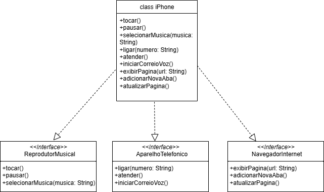

# Desafio iPhone - DIO
###  Bootcamp Santander Back-end JAVA 2025

Este repositório apresenta a resolução do desafio de Programação Orientada a Objetos (POO) da DIO, focado na modelagem e implementação do componente iPhone.

✨ Funcionalidades Implementadas

O modelo do iPhone integra as seguintes capacidades:

- Reprodutor Musical: Tocar, pausar, selecionar música.
- Aparelho Telefônico: Ligar, atender, iniciar correio de voz.
- Navegador na Internet: Exibir página, adicionar nova aba, atualizar página.

📊 Diagrama UML

O diagrama de classes abaixo ilustra a estrutura e as relações entre a classe iPhone e as interfaces de funcionalidade.

## 👨‍💻 Autora

[monickecunha](https://github.com/monickecunha/) - Estudante de Análise e Desenvolvimento de Sistemas.
